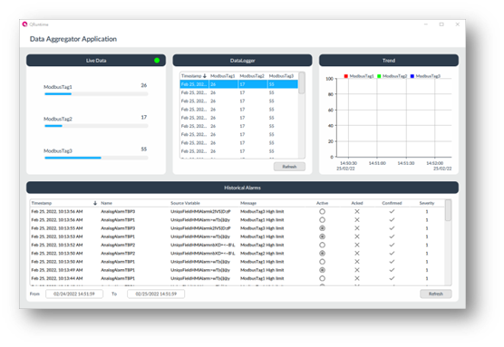
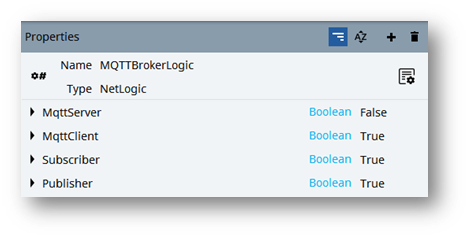
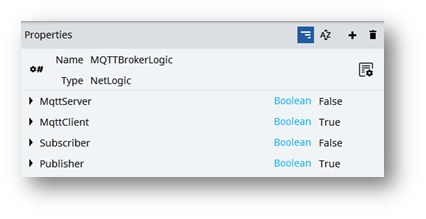
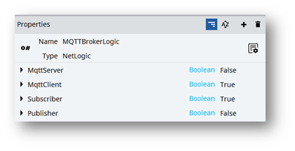
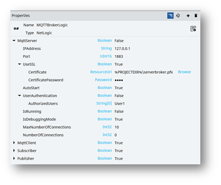
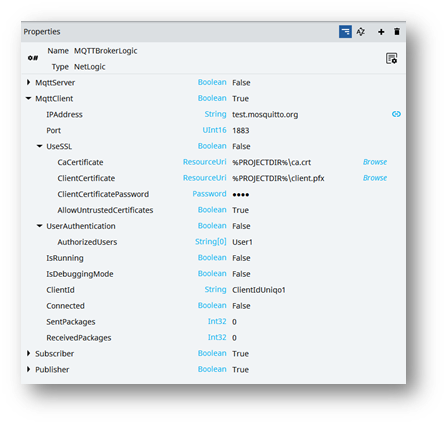
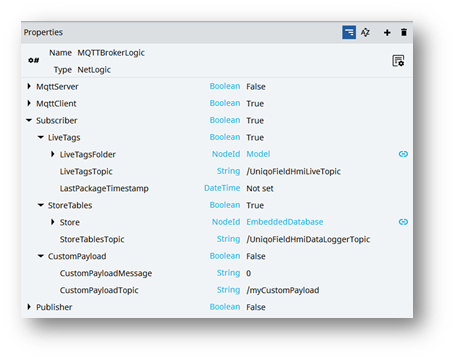
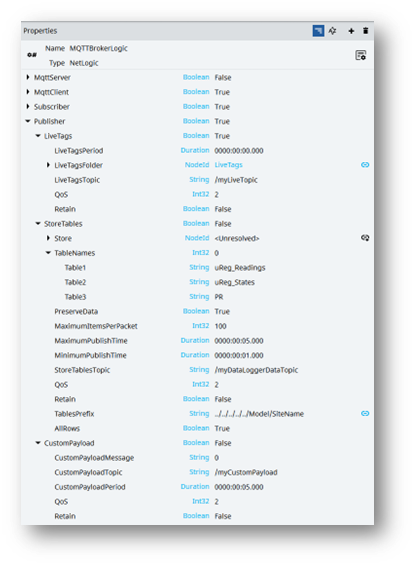

# Data Aggregator Application

## Introduction
Demo MQTT is an example consisting of two projects: Field Application and Data Aggregator Application. The objective of this demo is to simply show an example of communication via MQTT protocol between a hypothetical application running on a machine/plant (Field Application) and an application that collects the data sent by the machine, showing them in the form of a dashboard (Data Aggregator Application). Usually, it would be done only with the visualization of historical data (cold data) but in this project, we also wanted to show an example of receiving live data.

## How to start the project
To setup the Field Application and/or to solve compiling issues/missed references please read the `MQTT_Field` documentation

## Important information
The example is provided as-is and can be a useful reference for building your application. The example as it is cannot be used on a real machine but must be adapted for the purpose, respecting the highest safety standards required. A public and open source MQTT broker is used in the project for demonstration purposes only, it is not secured, and its uptime can’t be guaranteed. We strongly encourage you to change the topic and server names using your provider before deploying the final application.

## Please note 
This application works paired with the Field Application, showing data received via MQTT protocol in form of a control dashboard. 

### STEP 1

Start the Field Application 

### STEP 2

After that, open this project on another FT Optix window and run the application with FT Optix Emulator.
  
### STEP 3

If the connection with the Field Application is working, the “Live Data” LED will be green.
 
## Detailed informations

The data exchange is based on a Runtime Netlogic which can be found in the Netlogic folder. The Netlogic MQTTBrokerLogic is present on both applications but is configured differently.

### Field application

Here the Runtime Netlogic acts as Publisher, in this way it publishes data on certain topics, addressed to an MQTT broker.

### Data aggregator application

Here the Runtime Netlogic works as Subscriber: subscribing to the topics on which the Field Application publishes, it shows all data in the form of a dashboard.

## MQTT BrokerLogic

### MQTT Server

It should be activated (TRUE) only if you want to use your Uniqo application as a Broker (hence not using an existing MQTT broker, in this example test.mosquitto.org).
 
Parameters:
- IPAddress: IP address where the Broker will be instantiated
- Port: number of the port on which the broker is listening
- UseSSL: enables the use of certificates 
 - Certificate 
 - CertificatePassword 
- AutoStart *LEAVE TRUE*
- UserAuthentication: if true only the specified users can access
 - AuthorizedUsers 
- IsRunning: Server status
- IsDebuggingMode *NOT USED*
- MaxNumberOfConnections: maximum number of clients that can connect to the Broker
- NumberOfConnections: number of active connections

### MQTT Client

It must always be active (TRUE) because it is the connection with the Broker to which you publish or to which you subscribe. If you want to connect two applications, you need to set the same broker and the same port on both projects. Instead, the ClientID parameter must be different (unique) on each application.   

Parameters:
- IPAddress: broker address (test.mosquitto.org) could be external like in this case, or internal if the application work as a broker (e.g., MQTTBrokerLogic.MQTTServer.IPAddress)
- Port: broker port (1883 for test.mosquitto.org) 
- UseSSL: Switch to TRUE if the broker requires certificates
   - CaCertificate
   - ClientCertificate
   - ClientCertificatePassword
   - AllowUntrustedCertificates
- UserAuthentication: Switch to TRUE if the broker requires authorized users. 
   - AuthorizedUsers: String array which contains Uniqo users (User1; User2; User […]); 
- IsRunning *NOT USED*
- IsDebuggingMode *NOT USED*
- ClientId: this is the unique Id, different for each application that wants to participate in the data sharing/exchange 
- Connected: connection status to the broker 
- SentPackages *STATS*
- ReceivedPackages *STATS*

### Subscriber

It must be active (TRUE) if your application needs to receive data published on the broker.

 
Parameters:
- LiveTags: TRUE = receive LIVE DATA
   - LiveTagsFolder: this folder/Node contains a copy of the Publisher LiveTagsFolder parameter, on which the Netlogic will copy the values read from the broker.
   - LiveTagsTopic: on this parameter needs to be specified the topic on which you are subscribed, and you want to receive live variables/tags values. 
   - LastPackageTimestamp: Timestamp of the last published packet
- StoreTables: TRUE = receive HISTORICAL DATA 
   - Store: DataStore on which we are saving received data.
      The store’s tables must be renamed with the “TablesPrefix” parameter, plus the name of the publisher application tables. Below is an example:
      - Publisher application DataStore table names: Datalogger, AlarmsEventLogger
      - Publisher “TablesPrefix” parameter: Station1
      - Subscriber application DataStore table names: Station1_DataLogger, Station1_EventLogger
      Verify to have the same columns you have on the Publisher application
   - StoreTablesTopic: on this parameter needs to be specified the topic on which you are subscribed, and you want to receive historical variables/tags values.
- CustomPayload: Custom message without pre-defined format 
    - CustomPayloadMessage: Custom text message from the CustomPayloadTopic
    - CustomPayloadTopic: On this parameter needs to be specified the topic on which you are subscribed, and you want to receive custom messages.

### Publisher

It must be active (TRUE) if your application needs to publish data to the broker.

 
Parameters:
- LiveTags: TRUE = publish LIVE DATA
   - LiveTagsPeriod: Sending frequency (if 0000:00:00.000 send data on value change).
   - LiveTagsFolder: folder (or node) that contains data to be sended
   - LiveTagsTopic: /UniqoFieldHmiLiveTopic is the topic on which we are sending/publishing data
   - QoS: MQTT Quality of Service (0,1,2)
   - Retain: Retain message on the topic even after read
- StoreTables: TRUE = publish HISTORICAL DATA
   - Store: DataStore on which we are saving our data
   - TableNames: Store tables to be sended
       -	Table1: Datalogger
       - Table2: AlarmsEventLogger
       - Table (…) *could be added or removed*
   - PreserveData *NOT USED*
   - MaximumItemsPerPacket: define how many rows per packet to send
   - MaximumPublishTime: Maximum waiting time before publishing data even if not reached the MaximumItemsPerPacket value.
   - MinimumPublishTime: Minimum waiting time before publishing data when the MaximumItemsPerPacket value is reached.
   - StoreTablesTopic : /UniqoFieldHmiDataLoggerTopic is the topic on which we are sending/publishing data
   - QoS: MQTT Quality of Service (0,1,2)
   - Retain: Retain message on the topic even after read
   - TablesPrefix:  A model variable containing the hypothetical name of different production sites, in this case, will be “Station1”. Into the sent packet will appear the table sent with the unique prefix corresponding to the right machine/site from which the packet arrives (Station1_AlarmsEventLogger). This is useful when we have more than one of the same machine model/more than one of the same plant configurations and we need to distinguish from which machine/plant data arrives.
 - AllRows: When is TRUE, publish all the data already present in the Store Tables. Set on FALSE to publish only the data stored after the implementation of the MQTTBrokerLogic.
- CustomPayload: Custom message without pre-defined format
   - CustomPayloadMessage: Custom text message published to the CustomPayloadTopic
   - CustomPayloadTopic: The topic on which the message will be published
   - CustomPayloadPeriod: Sending frequency of the custom message (if 0000:00:00.000 send data on value change)
   - QoS: MQTT Quality of Service (0,1,2)
   - Retain: Retain message on the topic even after read

## Disclaimer

Rockwell Automation maintains these repositories as a convenience to you and other users. Although Rockwell Automation reserves the right at any time and for any reason to refuse access to edit or remove content from this Repository, you acknowledge and agree to accept sole responsibility and liability for any Repository content posted, transmitted, downloaded, or used by you. Rockwell Automation has no obligation to monitor or update Repository content

The examples provided are to be used as a reference for building your own application and should not be used in production as-is. It is recommended to adapt the example for the purpose, observing the highest safety standards.

